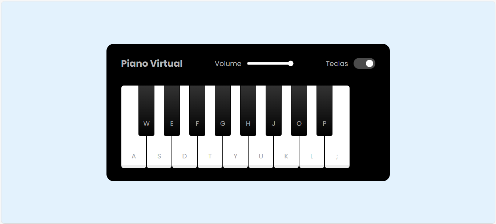

# Piano Virtual - Simulador de Teclado Musical 🎹

Um piano virtual interativo que permite tocar utilizando o mouse ou teclado do computador. Desenvolvido com HTML, CSS e JavaScript puro, este projeto oferece uma experiência musical intuitiva e divertida.

## Funcionalidades ✨

- **Teclado interativo completo** com teclas brancas e pretas
- **Controle de volume** ajustável
- **Opção para mostrar/esconder** as letras das teclas
- **Toque com mouse** (clicando nas teclas) ou **teclado** (usando as teclas mapeadas)
- **Efeitos visuais** ao tocar as notas
- **Design responsivo** e moderno

## Tecnologias Utilizadas 🛠️

- HTML5
- CSS3 (com Flexbox)
- JavaScript Vanilla
- Google Fonts (Poppins)

## Como Usar 🎮

1. Clone o repositório ou faça o download dos arquivos
2. Abra o arquivo `index.html` no seu navegador
3. Toque as teclas usando:
   - Mouse: clicando nas teclas do piano
   - Teclado: usando as teclas correspondentes (a, w, s, e, d, f, etc.)
4. Ajuste o volume com o slider
5. Mostre/oculte as letras das teclas com o checkbox

## Personalização 🔧

Você pode facilmente:
- Alterar o design modificando o arquivo `style.css`
- Adicionar mais teclas editando o HTML e JavaScript
- Trocar os sons das teclas (os arquivos de áudio devem estar na pasta `musicas` com os nomes correspondentes)

Divirta-se criando música! 🎶
